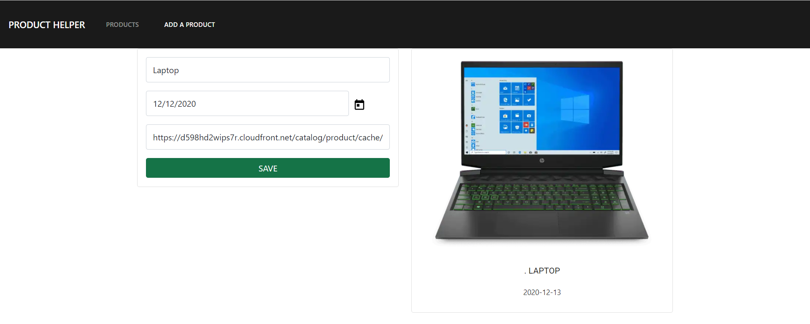
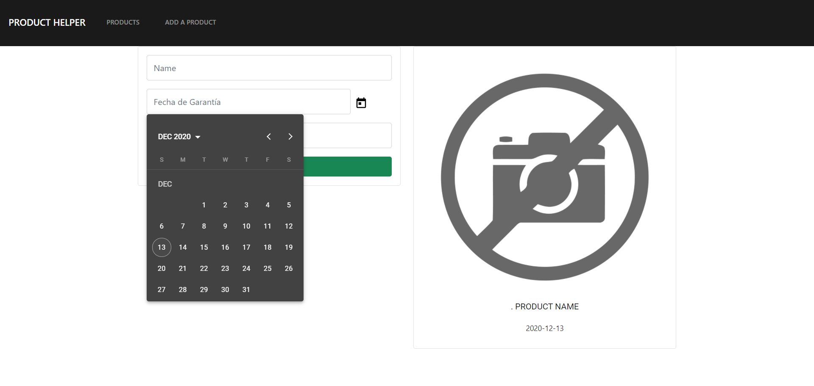
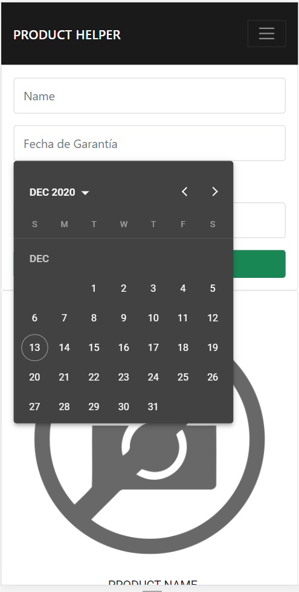
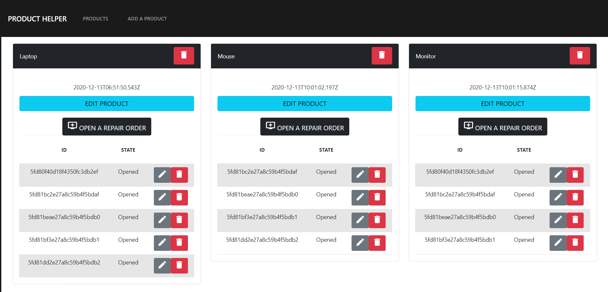

# DEVELOPER-TEST TO PREDIALIZE
In progress
Developer Test - Product Helper
I have done so far all of the backend part. I have some issues with the frontend in Angular but I can solve them.

##Instructions for instalation
- To run server: npm run dev
- To run web page: ng serve en src/client

##API

- Get all the products

GET http://localhost:3000/api/products HTTP/1.1

- Create a product

POST http://localhost:3000/api/products HTTP/1.1 Content-Type: application/json

- Get a single product

GET http://localhost:3000/api/products/5b0624a7abcb202a3af189b6 HTTP/1.1

- Update a product

PUT http://localhost:3000/api/products/5b0624a7abcb202a3af189b6 Content-Type: application/json

- Delete a product

DELETE http://localhost:3000/api/products/5b0627e6edb8f82dcc1486ff

- GET all processes of a product (Get Tickets By Product)

GET http://localhost:3000/api/products/5b0624a7abcb202a3af189b6/processes

- Create a process of a product (Create Ticket by Product)

POST http://localhost:3000/api/products/5b0624a7abcb202a3af189b6/processes HTTP/1.1 Content-Type: application/json

FRONTEND - Not finished (70% -Integration of tickets is missing)

##Structure

- images : Images of README
- node-modules : node-modules installed by npm
- server: Backend (Node, Express, MongoDB, Mongoose)
- src: FrontEnd (Angular, Angular Material, FlexboxGrid, Bootstrap)

Thanks for your Attention!!

Contact: kquinonesa14@gmail.com  Kevin Quiñones
